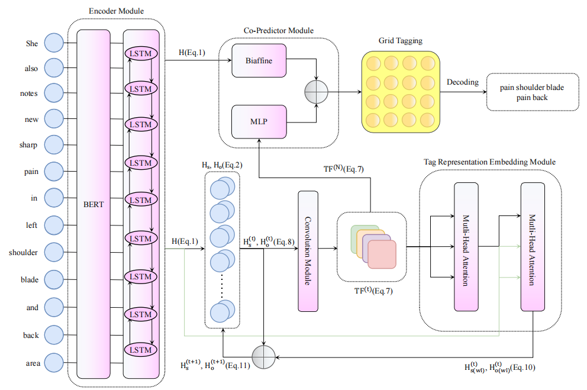

# TOE: A Grid-Tagging Model for Discontinuous Named Entity Recognition with Tag-Oriented Enhancement

### Abstract
<div>
&emsp;So far discontinuous named entity recognition (NER) has received increasing research attention and many related methods have surged such as hypergraph-based methods, span-based methods and sequence-to-sequence (Seq2Seq) methods, etc. However, these methods more or less suffer from some problems, which limit their performances. Recently, grid-tagging methods, which benefit from the flexible design of tagging systems and model architectures, have shown the superiority to adapt for various natural language understanding tasks. In this paper, we follow the line of such methods and propose a competitive grid-tagging model for discontinuous NER. We call our model TOE because we incorporate two kinds of Tag-Oriented Enhancement mechanisms into a state-of-the-art (SOTA) grid-tagging model that casts the NER problem into word-word relation prediction. First, we design a Tag Representation Embedding Module (TREM) to force our model to consider not only word-word relations but also word-tag and tag-tag relations. On the other hand, we also introduce two new tags to model more fine-grained word-word relations and alleviate error propagation from model prediction. In the experiments of three benchmark datasets, namely CADEC, ShARe13 and ShARe14, our TOE model pushes the SOTA results by about 1.1%, 0.8% and 1.1% in F1, demonstrating its effectiveness.
</div>
<br>

### Model Framework



## 1. Environments
```text
- python (3.8)
- cuda (11.4)
- torch (1.8.1)
- pip install -r requirements.txt
```

## 2. Dataset
   * [CADEC](https://pubmed.ncbi.nlm.nih.gov/25817970/)  
   * [ShARe13](https://clefehealth.imag.fr/?page_id=441)  
   * [ShARe14](https://sites.google.com/site/clefehealth2014/)

## 3. Pre-training
Download the pre-training model at the following link:
   * BioBERT: [https://huggingface.co/dmis-lab/biobert-base-cased-v1.2/tree/main](https://huggingface.co/dmis-lab/biobert-base-cased-v1.2/tree/main)  
   * ClinicalBERT: [https://huggingface.co/emilyalsentzer/Bio_ClinicalBERT/tree/main](https://huggingface.co/emilyalsentzer/Bio_ClinicalBERT/tree/main)

## 4. Preparation
   * Get dataset 
   * Process them to fit the same format as the example in `data/`
   * Put the processed data into the directory `data/`

## 5. Training
```text
python main.py --config ./config/cadec.json
```